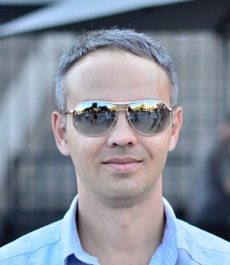

***

**1. Name Surname**

 # ***Ruslan Unaibayev***

 ***
**2. Contacts:**
>Karaganda city
>tel: +7(705)62-88-333
>e-mail: [rus516815@gmail.com ](https://www.gmail.com)
>github: [github.com/RuslanUn ](https://github.com/RuslanUn)

***
**3. About me**
*My main interest in IT is the constantly evolving stack of technologies, which does not stop its development for a minute, which in turn stimulates me to constantly engage in self-development. I love to learn and learn new things. Take classes. The desire to study IT is supported by the desire to realize oneself in this area, and also stimulates the study of the English language.*

***
**4. Skills**
* С;
* С++;
* C#;
* SQL;
* HTML;
* CSS;
* .NET;
* Git;
* GitHub;

***
**5. Code examples**

    function isPalindrome(line){
        var newLine=String(line);
        var lineLen = newLine.length;
        for (var i = 0; i < lineLen; i++){
            if (newLine[i] === newLine[lineLen - 1 - i]){ 
                return true
            } 
            else {
                return false;
            }
        }
        return true;
    }

***
**6. Work experience**
*I am constantly learning through* ["YouTube"](https://www.youtube.com/), ["METANIT.COM"](https://www.METANIT.COM/) *and other popular resources. I took a 1 month "C" languag course at* ["42 Silicon Valley"](https://www.42.us.org/) *and also took a 1 year ".Net" development course at the* ["Computer Academy STEP IT"](https://itstep.md/).

***
**7. Education**
* [Computer Academy STEP IT](https://itstep.md/) - 2020y.
*".Net developer"*;
* [Karaganda University of Kazpotrebsoyuz](https://www.keu.kz/) - 2020 y.-now
*"Information system"*;
* [42 Silicon Valley](https://www.42.us.org/) - 2019y.
*"C-language"*;
* [Karaganda University of Kazpotrebsoyuz](https://www.keu.kz/) - 2011y.
*"Jurisprudence"*;
* [Karaganda Techical University](https://www.kstu.kz/) - 2003y.
*"Electrical Engineer"*.

***
**8. Knowledge of languages**
English - A2
*I often travel to different countries, English helps to communicate with people from all over the world. For learning programming, a lot of interesting information can be found in English. Learning English helps both in travel, learning programming and in everyday life.*